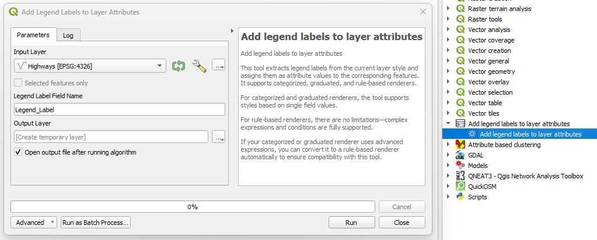
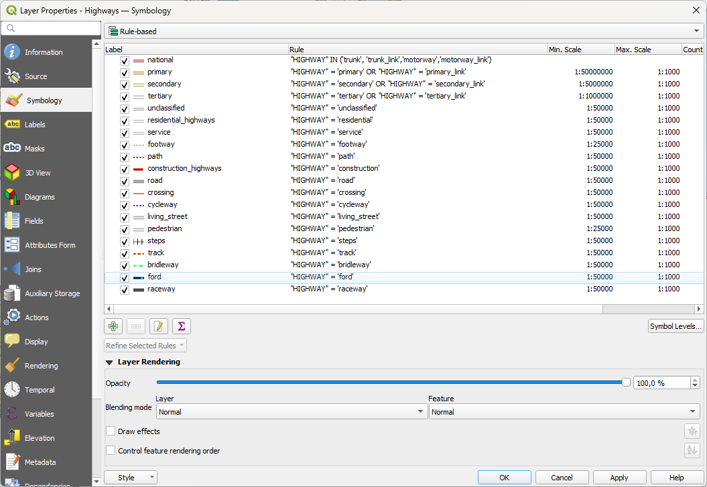
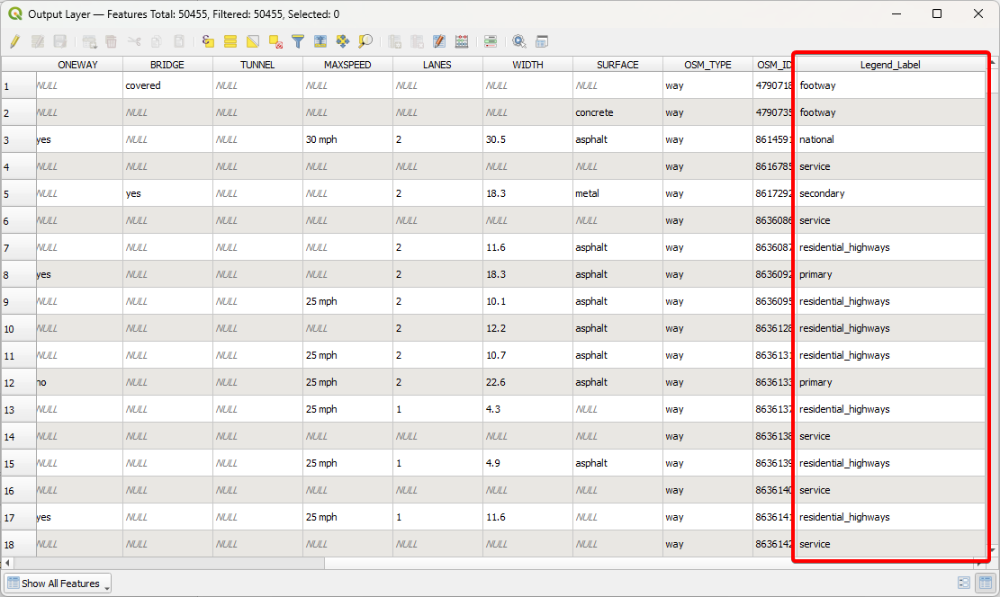

# Add legend labels to layer attributes
A QGIS plugin that extracts legend labels from the active layer's style and assigns them as attribute values to the corresponding features. Supports graduated, categorized and rule-based symbology.

## Supported renderers
* Rule-based renderer (any complexity).
* Graduated renderer (based on a single attribute).
* Categorized renderer (based on a single attribute).

Example of style settings:

Extracted legend labels:

## Documentation

General plugin documentation is available here: https://ekazakov.me/add-legend-labels-to-layer-attributes-qgis-plugin/

## Installation

The plugin is available in the official QGIS Plugin Repository.

You can also install it from ZIP archive.

## Contacts

Eduard Kazakov | ee.kazakov@gmail.com